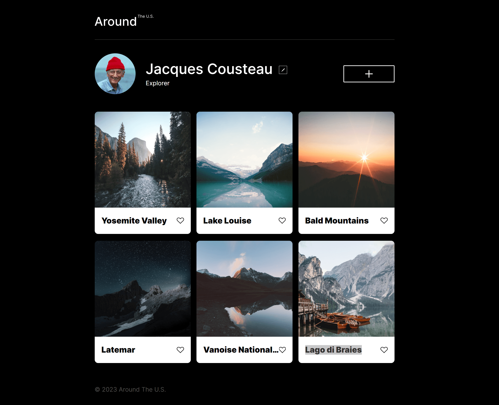
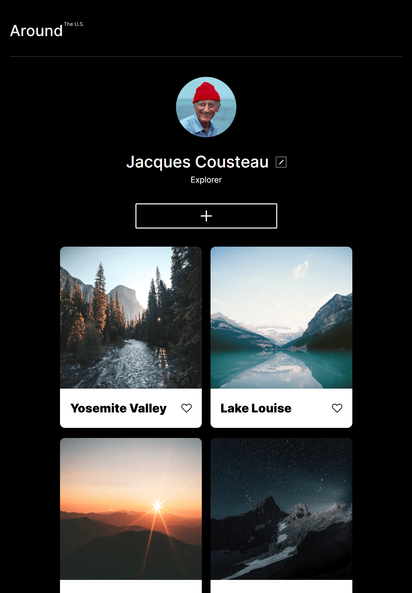
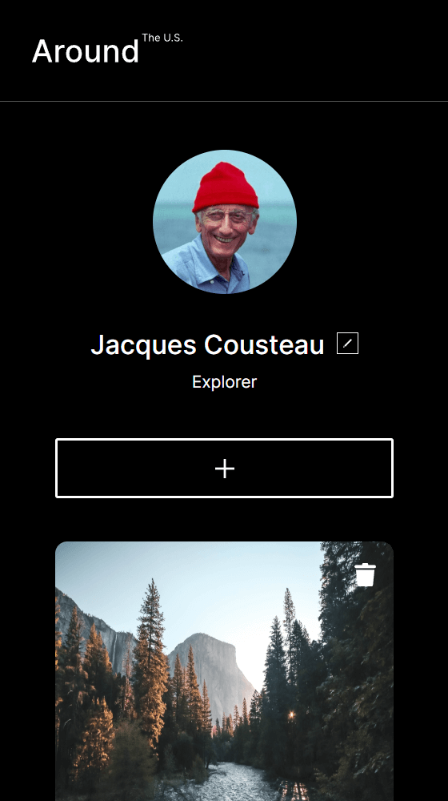
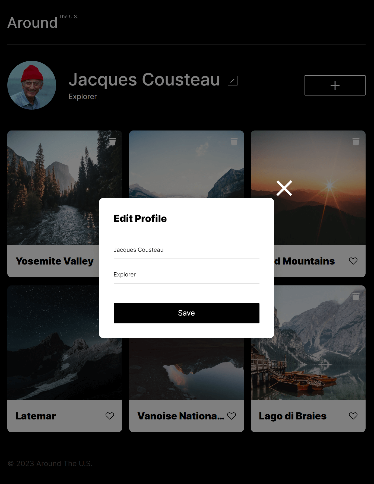

# Around The U.S.

## Author: Timothy Chan

### Summary

This project displays applying HTML and CSS skills like:

- Figma
- Images
- BEM
- Buttons
- Hover
- Smooth transitions
- Responsive web design
- Grid
- Grid with flexbox
- Media Queries
- Templates
- Modal Application
- Refactoring

This project also showcases JavaScript applications:

- Query selectors
- Array lists
- Objects
- Loops (ForEach)
- DOM
- Functions
- Universal functions (Don't repeat code)
- Event handlers
- Event listeners

The site is responsive to various different screen widths including:

- Mobile devices
- Tablets
- Desktops

**Page Link**

[Site!](https://timothyqchan.github.io/se_project_aroundtheus/)

**Images**

