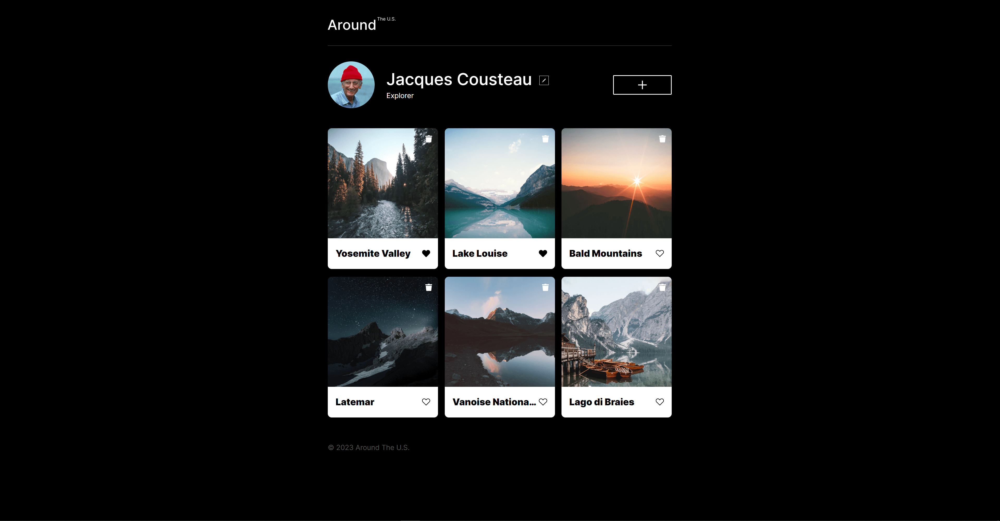
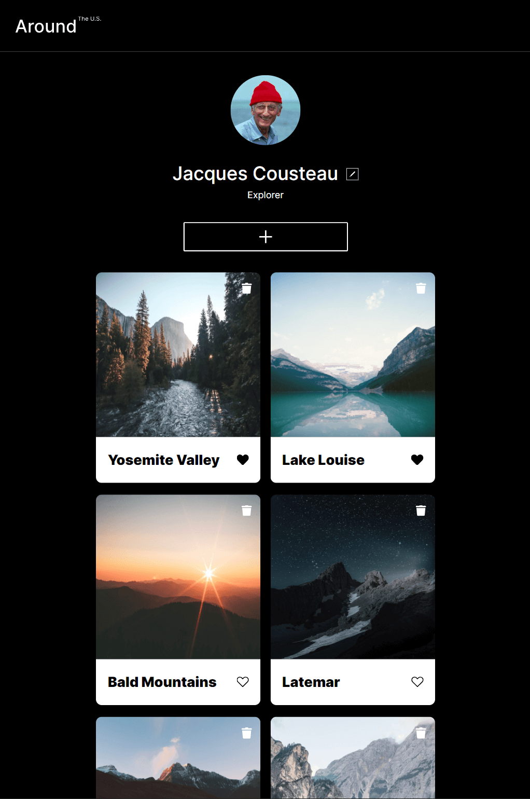

# Project 3: Around The U.S.

## Author: Timothy Chan

### Summery

This project showcases Jacques Cousteau, an explorer, with images of various locations including:

- Yosemite Valley
- Lake Louise
- Bald Mountains
- Latemar
- Vanoise National Park
- Lago di Braies

The site is responsive to various different screen widths including:

- Mobile devices
- Tablets
- Desktops

This project displays applying HTML and CSS skills like:

- Figma
- Images
- BEM
- Buttons
- Hover
- Smooth transitions
- Responsive web design
- Grid
- Grid with flexbox
- Media Queries

**Page Link**

[Site!](https://timothyqchan.github.io/se_project_aroundtheus/)

**Images**

